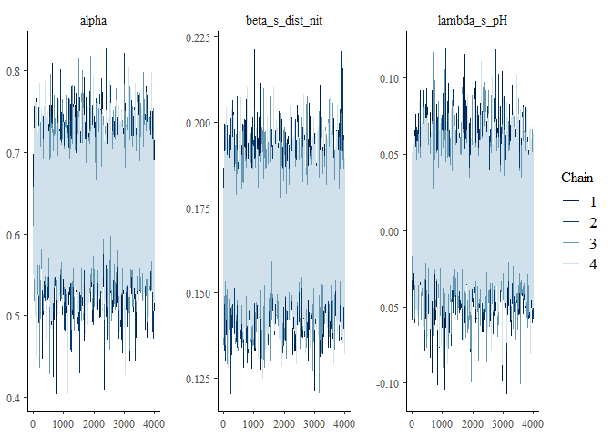
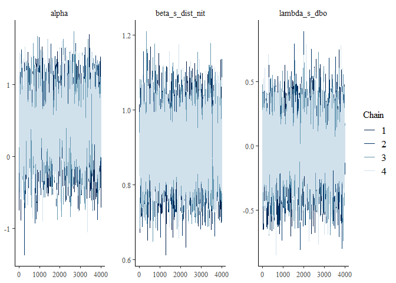
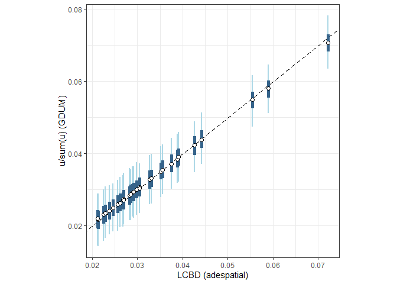

Untitled
================

# Fitting GDUMs in greta

Here we show how to fit and inspect Generalised Dissimilarity Uniqueness
Models (DGUM) using greta. We provide some helper functions to construct
the models and generate predictions.This scripts assumes that a folder
named `functions` exists in the working directory with the helper
functions provided [here](link).

There are the necessary packages:

``` r
library(greta)
library(coda)
library(bayesplot)
library(ggplot2)
library(tidyverse)
```

Note that `greta` requires some additional dependencies. Please check
[greta-stats.org/](https://greta-stats.org/) for more information.

We also source some convenience functions to help prepare the data and
building the model.

``` r
# Load functions
dir <- './functions/'
files.sources = list.files(dir)
sapply(paste0(dir,files.sources), source)
```

## Case-study: Fish from the doubs river

We will use the [doubs
dataset](https://www.davidzeleny.net/anadat-r/doku.php/en:data:doubs) as
an example. The dataset contains abundances of fish species along the
doubs river.

``` r
# Load datasets
doubs.spe <- read.csv('https://raw.githubusercontent.com/zdealveindy/anadat-r/master/data/DoubsSpe.csv', row.names = 1)
doubs.env <- read.csv('https://raw.githubusercontent.com/zdealveindy/anadat-r/master/data/DoubsEnv.csv', row.names = 1)
doubs.spa <- read.csv('https://raw.githubusercontent.com/zdealveindy/anadat-r/master/data/DoubsSpa.csv', row.names = 1)
```

doubs.spe

| CHA | TRU | VAI | LOC | OMB | BLA | HOT | TOX | VAN | CHE | BAR | SPI | GOU | BRO | PER | BOU | PSO | ROT | CAR | TAN | BCO | PCH | GRE | GAR | BBO | ABL | ANG |
|----:|----:|----:|----:|----:|----:|----:|----:|----:|----:|----:|----:|----:|----:|----:|----:|----:|----:|----:|----:|----:|----:|----:|----:|----:|----:|----:|
|   0 |   3 |   0 |   0 |   0 |   0 |   0 |   0 |   0 |   0 |   0 |   0 |   0 |   0 |   0 |   0 |   0 |   0 |   0 |   0 |   0 |   0 |   0 |   0 |   0 |   0 |   0 |
|   0 |   5 |   4 |   3 |   0 |   0 |   0 |   0 |   0 |   0 |   0 |   0 |   0 |   0 |   0 |   0 |   0 |   0 |   0 |   0 |   0 |   0 |   0 |   0 |   0 |   0 |   0 |
|   0 |   5 |   5 |   5 |   0 |   0 |   0 |   0 |   0 |   0 |   0 |   0 |   0 |   1 |   0 |   0 |   0 |   0 |   0 |   0 |   0 |   0 |   0 |   0 |   0 |   0 |   0 |
|   0 |   4 |   5 |   5 |   0 |   0 |   0 |   0 |   0 |   1 |   0 |   0 |   1 |   2 |   2 |   0 |   0 |   0 |   0 |   1 |   0 |   0 |   0 |   0 |   0 |   0 |   0 |
|   0 |   2 |   3 |   2 |   0 |   0 |   0 |   0 |   5 |   2 |   0 |   0 |   2 |   4 |   4 |   0 |   0 |   2 |   0 |   3 |   0 |   0 |   0 |   5 |   0 |   0 |   0 |
|   0 |   3 |   4 |   5 |   0 |   0 |   0 |   0 |   1 |   2 |   0 |   0 |   1 |   1 |   1 |   0 |   0 |   0 |   0 |   2 |   0 |   0 |   0 |   1 |   0 |   0 |   0 |

doubs.env

|  das | alt |  pen |  deb |  pH | dur |  pho |  nit |  amm |  oxy | dbo |
|-----:|----:|-----:|-----:|----:|----:|-----:|-----:|-----:|-----:|----:|
|  0.3 | 934 | 48.0 | 0.84 | 7.9 |  45 | 0.01 | 0.20 | 0.00 | 12.2 | 2.7 |
|  2.2 | 932 |  3.0 | 1.00 | 8.0 |  40 | 0.02 | 0.20 | 0.10 | 10.3 | 1.9 |
| 10.2 | 914 |  3.7 | 1.80 | 8.3 |  52 | 0.05 | 0.22 | 0.05 | 10.5 | 3.5 |
| 18.5 | 854 |  3.2 | 2.53 | 8.0 |  72 | 0.10 | 0.21 | 0.00 | 11.0 | 1.3 |
| 21.5 | 849 |  2.3 | 2.64 | 8.1 |  84 | 0.38 | 0.52 | 0.20 |  8.0 | 6.2 |
| 32.4 | 846 |  3.2 | 2.86 | 7.9 |  60 | 0.20 | 0.15 | 0.00 | 10.2 | 5.3 |

doubs.spa

|   x |   y |
|----:|----:|
|  88 |   7 |
|  94 |  14 |
| 102 |  18 |
| 100 |  28 |
| 106 |  39 |
| 112 |  51 |

## Preparing data

We provide two functions to help formatting the data: `make_x_df()` and
`make_y_df()`. `make_x_df()` generates a matrix of pairwise distances
for the variables of interest:

``` r
X <- make_x_df(env = doubs.env, 
               scale = FALSE, 
               method = 'euclidean',
               collapse = FALSE) 
kableExtra::kable(head(X))
```

|     |  s1 |  s2 | dist_das | dist_alt | dist_pen | dist_deb | dist_pH | dist_dur | dist_pho | dist_nit | dist_amm | dist_oxy | dist_dbo |
|:----|----:|----:|---------:|---------:|---------:|---------:|--------:|---------:|---------:|---------:|---------:|---------:|---------:|
| 2   |   2 |   1 |      1.9 |        2 |     45.0 |     0.16 |     0.1 |        5 |     0.01 |     0.00 |     0.10 |      1.9 |      0.8 |
| 3   |   3 |   1 |      9.9 |       20 |     44.3 |     0.96 |     0.4 |        7 |     0.04 |     0.02 |     0.05 |      1.7 |      0.8 |
| 4   |   4 |   1 |     18.2 |       80 |     44.8 |     1.69 |     0.1 |       27 |     0.09 |     0.01 |     0.00 |      1.2 |      1.4 |
| 5   |   5 |   1 |     21.2 |       85 |     45.7 |     1.80 |     0.2 |       39 |     0.37 |     0.32 |     0.20 |      4.2 |      3.5 |
| 6   |   6 |   1 |     32.1 |       88 |     44.8 |     2.02 |     0.0 |       15 |     0.19 |     0.05 |     0.00 |      2.0 |      2.6 |
| 7   |   7 |   1 |     36.5 |       93 |     41.4 |     3.16 |     0.2 |       43 |     0.06 |     0.05 |     0.00 |      1.1 |      0.5 |

`make_y_df()` computes pairwise dissimilarities and returns a data frame
in long format. Different options are available, including:

- Methods available in `vegan::vegdist()`:
  `make_y_df(data, method = 'bray')`
- Numerator-denominator versions of Sorensen and Jaccard indices:
  `make_y_df(data, method = 'jaccard', num_den = TRUE)`
- Full matrix of shared and unshared species between samples:
  `make_y_df(data, method = 'abcd')`

We generate different Y matrices to show how GDUM can handle different
families

``` r
Y_bin <- make_y_df(com = doubs.spe, method = 'sorensen', num_den = TRUE)
kableExtra::kable(head(Y_bin))
```

|     |  s1 |  s2 | num_sor | den_sor |
|:----|----:|----:|--------:|--------:|
| 2   |   2 |   1 |       2 |       4 |
| 3   |   3 |   1 |       3 |       5 |
| 4   |   4 |   1 |       7 |       9 |
| 5   |   5 |   1 |      10 |      12 |
| 6   |   6 |   1 |       9 |      11 |
| 7   |   7 |   1 |       4 |       6 |

``` r
Y_bray <- make_y_df(com = doubs.spe, trans = log1p)
```

    ## Warning in vegan::vegdist(com, method = method): you have empty rows: their dissimilarities may be
    ##                  meaningless in method "bray"

``` r
kableExtra::kable(head(Y_bray))
```

|     |  s1 |  s2 |      diss |
|:----|----:|----:|----------:|
| 2   |   2 |   1 | 0.5509095 |
| 3   |   3 |   1 | 0.6280761 |
| 4   |   4 |   1 | 0.7446012 |
| 5   |   5 |   1 | 0.8664653 |
| 6   |   6 |   1 | 0.7657643 |
| 7   |   7 |   1 | 0.6519273 |

Outputs from `make_y_df()` and `make_x_df()` contain two columns that
indicate which pair of samples are compared in each row: `s1` and `s2`.
These columns should be consistent across datasets.

``` r
all.equal(X[,c('s1','s2')],Y_bin[,c('s1','s2')])
```

    ## [1] TRUE

## Fitting models

We provide a function (`fit_gdum()`) to help built GDUMs in `greta`. By
deafault, `fit_gdum()` uses uninformative priors that expect predictors
to be scaled. In this example, we use nitrogen concentration as a
pairwise predictor and dbo as a site-level effect.

``` r
X$s_dist_nit <- scale(X$dist_nit)
doubs.env$s_dbo <- scale(log(doubs.env$dbo))
```

In addition, a design matrix `D` indicating which sites are ocmpared in
each row is required to match dissimilarities with pairwise- and
site-level predictor.

``` r
D <- X[,c('s1','s2')]
```

### Gaussian distribution

``` r
m_gaus <- fit_gdum(Y = Y_bray[,3], # Dissimilarities
         W = doubs.env, # Site level predictors
         X = X, # Pairwise level predictors
         D = D, # Design matrix 
         family = 'gaussian',
         link = 'identity',
         diss_formula = ~ s_dist_nit, # pairwise level formula 
         site_formula = ~ dbo, # site level formula
         warmup = 2000, # mcmc warm up
         n_samples = 4000, # samples taken after warm up
         Lmin = 15, 
         Lmax = 20)
```

`Lmin` and `Lmax` are parameters passed to `greta::hmc()`. See
[greta-stats.org/reference/samplers](https://greta-stats.org/reference/samplers)
for more information.

We can explore MCMC chains using functions in `coda` and `bayesplot`
functions. MCMC chains are in `m_gaus$draws`.

``` r
bayesplot::mcmc_trace(m_gaus$draws, regex_pars = c('alpha','beta','lambda'))
```

<!-- -->

- `alpha` is the global intercept
- `beta_X` are the coefficients for oairwise-level predictors
- `labmda_X` are the coefficients for site-level predictors

In additin, `coda::gelman.diag()` can be used to compute the
[Gelman-Rubin](https://en.wikipedia.org/wiki/Gelman-Rubin_statistic)
statistic

``` r
coda::gelman.diag(m_gaus$draws)
```

    ## Potential scale reduction factors:
    ## 
    ##                 Point est. Upper C.I.
    ## alpha                 1.03       1.08
    ## SD_s                  1.00       1.01
    ## sigma                 1.00       1.01
    ## beta_s_dist_nit       1.00       1.00
    ## lambda_dbo            1.00       1.01
    ## e_s[1,1]              1.01       1.04
    ## e_s[2,1]              1.01       1.04
    ## e_s[3,1]              1.02       1.07
    ## e_s[4,1]              1.01       1.04
    ## e_s[5,1]              1.02       1.06
    ## e_s[6,1]              1.01       1.04
    ## e_s[7,1]              1.01       1.04
    ## e_s[8,1]              1.00       1.01
    ## e_s[9,1]              1.01       1.04
    ## e_s[10,1]             1.03       1.09
    ## e_s[11,1]             1.01       1.04
    ## e_s[12,1]             1.02       1.05
    ## e_s[13,1]             1.02       1.05
    ## e_s[14,1]             1.01       1.04
    ## e_s[15,1]             1.02       1.07
    ## e_s[16,1]             1.02       1.06
    ## e_s[17,1]             1.02       1.05
    ## e_s[18,1]             1.03       1.08
    ## e_s[19,1]             1.01       1.04
    ## e_s[20,1]             1.02       1.04
    ## e_s[21,1]             1.02       1.06
    ## e_s[22,1]             1.01       1.04
    ## e_s[23,1]             1.00       1.00
    ## e_s[24,1]             1.00       1.01
    ## e_s[25,1]             1.00       1.01
    ## e_s[26,1]             1.01       1.01
    ## e_s[27,1]             1.01       1.04
    ## e_s[28,1]             1.01       1.03
    ## e_s[29,1]             1.01       1.04
    ## e_s[30,1]             1.02       1.06
    ## 
    ## Multivariate psrf
    ## 
    ## 1.05

In our case, all values are relatively small ($\geq 1.01$) indicating
that chains have succesfully converged.

The `summary` of the draws provides the estimated value of each model
parameter

``` r
summary(m_gaus$draws)[[1]][1:5,]
```

    ##                         Mean          SD     Naive SE Time-series SE
    ## alpha            0.645169575 0.082863599 6.550943e-04   0.0038088617
    ## SD_s             0.135521464 0.021101020 1.668182e-04   0.0004763780
    ## sigma            0.187632280 0.006391207 5.052693e-05   0.0001496850
    ## beta_s_dist_nit  0.167676166 0.013465085 1.064508e-04   0.0001599151
    ## lambda_dbo      -0.001342392 0.006768390 5.350882e-05   0.0002375143

- `sigma` is the standard deviation of the normally distributed
  residuals
- `SD_s` is the standard deviation associated to site-level random
  effects

### Other distributions

#### Beta distribution

Note that the beta distribution does not allow for 0s or 1s. For the
sake of this example, we replace those values with `0.001` and `0.999`
respectively.

``` r
Y_bray$diss2 <- ifelse(Y_bray$diss == 0, 0.001, Y_bray$diss)
Y_bray$diss2 <- ifelse(Y_bray$diss2 == 1, 0.999, Y_bray$diss2)

m_beta <- fit_gdum(Y = Y_bray$diss2, 
         W = doubs.env, 
         X = X, 
         D = D, 
         family = 'beta',
         link = 'logit',
         diss_formula = ~ s_dist_nit,
         site_formula = ~ dbo,
         warmup = 2000,
         n_samples = 4000,
         Lmin = 10,
         Lmax = 15)
```

``` r
summary(m_beta$draws)[[1]][1:5,]
```

    ##                        Mean         SD     Naive SE Time-series SE
    ## alpha           0.618202923 0.44667682 0.0035312903   0.0130756952
    ## SD_s            0.812651176 0.11971757 0.0009464505   0.0019021429
    ## phi             4.979850936 0.34263141 0.0027087391   0.0038432017
    ## beta_s_dist_nit 0.810009281 0.06694243 0.0005292264   0.0006100012
    ## lambda_dbo      0.004086565 0.03782347 0.0002990208   0.0008437516

Instead of `sigma`, `phi` is the scale parameter of the beta
distribution. The larger the value of `phi`, the narrower the
distribution gets around the estimated dissimilarity.

#### Binomial distribution

The binomial distribution can be used when the dissimilarity index
corresponds to a proportion of shared of unshared items, such as the
Sørensen–Dice, Jaccard or Bray-Curtis dissimilarity indices. Both the
numerator and the denominator need to be supplied independently:

``` r
m_bin <- fit_gdum(Y = Y_bin$num_sor, # Dissimilarity (numerator: b + c)
         Y_den = Y_bin$den_sor,     # Dissimilarity (denominator: 2a + b + c)
         W = doubs.env, # Site level predictors
         X = X, # Pairwise level predictors
         D = D, # Design matrix 
         family = 'binomial',
         link = 'logit',
         diss_formula = ~ s_dist_nit,
         site_formula = ~ dbo,
         warmup = 2000,
         n_samples = 4000,
         Lmin = 10,
         Lmax = 15)
```

``` r
summary(m_bin$draws)[[1]][1:4,]
```

    ##                       Mean         SD     Naive SE Time-series SE
    ## alpha           0.33855256 0.62894274 0.0049722289   0.0474529300
    ## SD_s            1.32722129 0.19715255 0.0015586277   0.0075833945
    ## beta_s_dist_nit 0.95410354 0.03976369 0.0003143596   0.0005785759
    ## lambda_dbo      0.01674979 0.05535778 0.0004376417   0.0034260963

The binomial distribution does not contain any scale parameter because a
specific relationship between the variance, and the number of trials
(denominator), and the probability of success (estimated dissimilarity)
is expected.

#### Beta binomial distribution

The beta-binomial distribution can be useful when the data is over- or
under-dispersed compared to the binomial distribution.

``` r
m_bbin <- fit_gdum(Y = Y_bin$num_sor, # Dissimilarity matrix (numerator: b + c)
         Y_den = Y_bin$den_sor,     
         W = doubs.env, # Site level predictors
         X = X, # Pairwise level predictors
         D = D, # Design matrix 
         family = 'betabinomial',
         link = 'logit',
         diss_formula = ~ s_dist_nit,
         site_formula = ~ dbo,
         warmup = 2000,
         n_samples = 4000,
         Lmin = 10,
         Lmax = 15)
```

    ## running 4 chains simultaneously on up to 24 cores

    ## 

    ##     warmup                                           0/2000 | eta:  ?s              warmup =                                        50/2000 | eta:  1m | 4% bad     warmup ==                                      100/2000 | eta: 40s | 2% bad     warmup ===                                     150/2000 | eta: 34s | 2% bad     warmup ====                                    200/2000 | eta: 31s | 1% bad     warmup =====                                   250/2000 | eta: 29s | <1% bad    warmup ======                                  300/2000 | eta: 28s | <1% bad    warmup =======                                 350/2000 | eta: 26s | <1% bad    warmup ========                                400/2000 | eta: 25s | <1% bad    warmup =========                               450/2000 | eta: 24s | <1% bad    warmup ==========                              500/2000 | eta: 23s | <1% bad    warmup ==========                              550/2000 | eta: 23s | <1% bad    warmup ===========                             600/2000 | eta: 22s | <1% bad    warmup ============                            650/2000 | eta: 21s | <1% bad    warmup =============                           700/2000 | eta: 20s | <1% bad    warmup ==============                          750/2000 | eta: 19s | <1% bad    warmup ===============                         800/2000 | eta: 19s | <1% bad    warmup ================                        850/2000 | eta: 18s | <1% bad    warmup =================                       900/2000 | eta: 17s | <1% bad    warmup ==================                      950/2000 | eta: 16s | <1% bad    warmup ===================                    1000/2000 | eta: 15s | <1% bad    warmup ====================                   1050/2000 | eta: 15s | <1% bad    warmup =====================                  1100/2000 | eta: 14s | <1% bad    warmup ======================                 1150/2000 | eta: 13s | <1% bad    warmup =======================                1200/2000 | eta: 12s | <1% bad    warmup ========================               1250/2000 | eta: 11s | <1% bad    warmup =========================              1300/2000 | eta: 11s | <1% bad    warmup ==========================             1350/2000 | eta: 10s | <1% bad    warmup ===========================            1400/2000 | eta:  9s | <1% bad    warmup ============================           1450/2000 | eta:  8s | <1% bad    warmup ============================           1500/2000 | eta:  8s | <1% bad    warmup =============================          1550/2000 | eta:  7s | <1% bad    warmup ==============================         1600/2000 | eta:  6s | <1% bad    warmup ===============================        1650/2000 | eta:  5s | <1% bad    warmup ================================       1700/2000 | eta:  5s | <1% bad    warmup =================================      1750/2000 | eta:  4s | <1% bad    warmup ==================================     1800/2000 | eta:  3s | <1% bad    warmup ===================================    1850/2000 | eta:  2s | <1% bad    warmup ====================================   1900/2000 | eta:  2s | <1% bad    warmup =====================================  1950/2000 | eta:  1s | <1% bad    warmup ====================================== 2000/2000 | eta:  0s | <1% bad
    ##   sampling                                           0/4000 | eta:  ?s            sampling                                          50/4000 | eta:  1m            sampling =                                       100/4000 | eta:  1m            sampling =                                       150/4000 | eta:  1m            sampling ==                                      200/4000 | eta:  1m            sampling ==                                      250/4000 | eta:  1m            sampling ===                                     300/4000 | eta:  1m            sampling ===                                     350/4000 | eta:  1m            sampling ====                                    400/4000 | eta:  1m            sampling ====                                    450/4000 | eta:  1m            sampling =====                                   500/4000 | eta:  1m            sampling =====                                   550/4000 | eta:  1m            sampling ======                                  600/4000 | eta:  1m            sampling ======                                  650/4000 | eta:  1m            sampling =======                                 700/4000 | eta:  1m            sampling =======                                 750/4000 | eta:  1m            sampling ========                                800/4000 | eta:  1m            sampling ========                                850/4000 | eta: 50s            sampling =========                               900/4000 | eta: 49s            sampling =========                               950/4000 | eta: 48s            sampling ==========                             1000/4000 | eta: 47s            sampling ==========                             1050/4000 | eta: 46s            sampling ==========                             1100/4000 | eta: 45s            sampling ===========                            1150/4000 | eta: 44s            sampling ===========                            1200/4000 | eta: 44s            sampling ============                           1250/4000 | eta: 43s            sampling ============                           1300/4000 | eta: 42s            sampling =============                          1350/4000 | eta: 42s            sampling =============                          1400/4000 | eta: 41s            sampling ==============                         1450/4000 | eta: 41s            sampling ==============                         1500/4000 | eta: 40s            sampling ===============                        1550/4000 | eta: 39s            sampling ===============                        1600/4000 | eta: 38s            sampling ================                       1650/4000 | eta: 38s            sampling ================                       1700/4000 | eta: 37s            sampling =================                      1750/4000 | eta: 36s            sampling =================                      1800/4000 | eta: 35s            sampling ==================                     1850/4000 | eta: 34s            sampling ==================                     1900/4000 | eta: 33s            sampling ===================                    1950/4000 | eta: 33s            sampling ===================                    2000/4000 | eta: 32s            sampling ===================                    2050/4000 | eta: 31s            sampling ====================                   2100/4000 | eta: 30s            sampling ====================                   2150/4000 | eta: 30s            sampling =====================                  2200/4000 | eta: 29s            sampling =====================                  2250/4000 | eta: 28s            sampling ======================                 2300/4000 | eta: 27s            sampling ======================                 2350/4000 | eta: 27s            sampling =======================                2400/4000 | eta: 26s            sampling =======================                2450/4000 | eta: 25s            sampling ========================               2500/4000 | eta: 24s            sampling ========================               2550/4000 | eta: 24s            sampling =========================              2600/4000 | eta: 23s            sampling =========================              2650/4000 | eta: 22s            sampling ==========================             2700/4000 | eta: 21s            sampling ==========================             2750/4000 | eta: 20s            sampling ===========================            2800/4000 | eta: 20s            sampling ===========================            2850/4000 | eta: 19s            sampling ============================           2900/4000 | eta: 18s            sampling ============================           2950/4000 | eta: 17s            sampling ============================           3000/4000 | eta: 16s            sampling =============================          3050/4000 | eta: 16s            sampling =============================          3100/4000 | eta: 15s            sampling ==============================         3150/4000 | eta: 14s            sampling ==============================         3200/4000 | eta: 13s            sampling ===============================        3250/4000 | eta: 12s            sampling ===============================        3300/4000 | eta: 11s            sampling ================================       3350/4000 | eta: 11s            sampling ================================       3400/4000 | eta: 10s            sampling =================================      3450/4000 | eta:  9s            sampling =================================      3500/4000 | eta:  8s            sampling ==================================     3550/4000 | eta:  7s            sampling ==================================     3600/4000 | eta:  7s            sampling ===================================    3650/4000 | eta:  6s            sampling ===================================    3700/4000 | eta:  5s            sampling ====================================   3750/4000 | eta:  4s            sampling ====================================   3800/4000 | eta:  3s            sampling =====================================  3850/4000 | eta:  2s            sampling =====================================  3900/4000 | eta:  2s            sampling ====================================== 3950/4000 | eta:  1s            sampling ====================================== 4000/4000 | eta:  0s

``` r
bayesplot::mcmc_trace(m_bbin$draws, regex_pars = c('alpha','beta','lambda'))
```

<!-- -->

``` r
summary(m_bbin$draws)[[1]][1:5,]
```

    ##                         Mean         SD     Naive SE Time-series SE
    ## alpha           0.4460062632 0.57188118 0.0045211177   0.0220319214
    ## SD_s            1.1278485826 0.18043024 0.0014264263   0.0042405017
    ## phi             7.1965948269 0.70762598 0.0055942746   0.0061079179
    ## beta_s_dist_nit 0.9022000570 0.07302021 0.0005772755   0.0008520279
    ## lambda_dbo      0.0005656886 0.04996748 0.0003950276   0.0017117759

### Assessing compositional uniqueness

Community uniqueness (u) values, [equivalent to $SS_i$ in the
computation of LCBD](https://doi.org/10.1111/ele.12141), can be obtained
from the fitted model using the `predict_gdum()` function.

``` r
u_pred <- predict_gdum(m_gaus, response = 'uniqueness')
```

We can compare those with the ones obtained with `adespatial::`

``` r
u_pred$lcbd <- adespatial::LCBD.comp(vegan::vegdist(log1p(doubs.spe)))$LCBD
```

    ## Registered S3 methods overwritten by 'adegraphics':
    ##   method         from
    ##   biplot.dudi    ade4
    ##   kplot.foucart  ade4
    ##   kplot.mcoa     ade4
    ##   kplot.mfa      ade4
    ##   kplot.pta      ade4
    ##   kplot.sepan    ade4
    ##   kplot.statis   ade4
    ##   scatter.coa    ade4
    ##   scatter.dudi   ade4
    ##   scatter.nipals ade4
    ##   scatter.pco    ade4
    ##   score.acm      ade4
    ##   score.mix      ade4
    ##   score.pca      ade4
    ##   screeplot.dudi ade4

    ## Registered S3 method overwritten by 'spdep':
    ##   method   from
    ##   plot.mst ape

    ## Registered S3 methods overwritten by 'adespatial':
    ##   method             from       
    ##   plot.multispati    adegraphics
    ##   print.multispati   ade4       
    ##   summary.multispati ade4

    ## Warning in vegan::vegdist(log1p(doubs.spe)): you have empty rows: their dissimilarities may be
    ##                  meaningless in method "bray"

``` r
ggplot(u_pred, aes(x = lcbd, y = `50%`/sum(`50%`))) +
  theme_bw() +
  theme(aspect.ratio = 1) +
  coord_equal() + 
  geom_abline(lty = 5) +
  ylab('u/sum(u) (GDUM)') +
  xlab('LCBD (adespatial)') +
  geom_linerange(aes(ymax = `97.5%`/sum(`50%`), ymin = `2.5%`/sum(`50%`)), linewidth = 1, col = 'lightblue') +
  geom_linerange(aes(ymax = `75%`/sum(`50%`), ymin = `25%`/sum(`50%`)), linewidth = 2, col = 'steelblue4') + 
  geom_point(shape = 21, fill = 'white', size = 2)
```

<!-- -->

## Predictions and partial effects
